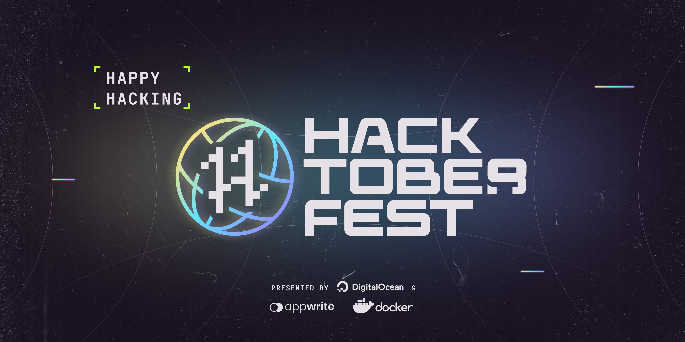

# 🚀 Awesome JavaScript Projects

In this repository, you can find JavaScript-based projects that beginners can use for their first web project. 

## 💙 For contributors

Please read the following before contributing to the repository:

- [Contribution Guide](./CONTRIBUTING.md)
- [Code of Conduct](./CODE_OF_CONDUCT.md)
- [Licence](./LICENCE.md)

## 💻 Projects

 
- [3-d-css](./projects/3-d-css) 
- [8-ball](./projects/8-ball) 
- [BMI-calculator](./projects/BMI-calculator) 
- [BlackJack-Game](./projects/BlackJack-Game) 
- [Count-down](./projects/Count-down) 
- [Currency-Convertor](./projects/Currency-Convertor) 
- [DiceGame](./projects/DiceGame) 
- [Drawing-App](./projects/Drawing-App) 
- [Event-Webpage](./projects/Event-Webpage) 
- [Food-delivery-system](./projects/Food-delivery-system) 
- [GYM-website](./projects/GYM-website) 
- [Github-Search-Profile-App](./projects/Github-Search-Profile-App) 
- [Gradient-Generator-Advanced](./projects/Gradient-Generator-Advanced) 
- [Gradient-generator](./projects/Gradient-generator) 
- [Guess-the-color](./projects/Guess-the-color) 
- [HeightConverter](./projects/HeightConverter) 
- [JavaScript-timeline](./projects/JavaScript-timeline) 
- [Login-Form](./projects/Login-Form) 
- [Notex](./projects/Notex) 
- [Palindrome-checker](./projects/Palindrome-checker) 
- [Parallax-webpage](./projects/Parallax-webpage) 
- [Pet-Conversation](./projects/Pet-Conversation) 
- [Pig-game](./projects/Pig-game) 
- [Quizer](./projects/Quizer) 
- [Stopwatch](./projects/Stopwatch) 
- [Student-Enrollment-Form](./projects/Student-Enrollment-Form) 
- [Survey-form](./projects/Survey-form) 
- [Temperature-Convertor](./projects/Temperature-Convertor) 
- [Tic-tac-toe](./projects/Tic-tac-toe) 
- [Todo](./projects/Todo) 
- [Tribute-project](./projects/Tribute-project) 
- [Weather-Forecast-Webapp](./projects/Weather-Forecast-Webapp) 
- [Windows11-Clone](./projects/Windows11-Clone) 
- [YearCounter](./projects/YearCounter) 
- [analog-clock](./projects/analog-clock) 
- [calculator](./projects/calculator) 
- [clock](./projects/clock) 
- [dark-mode-calculator](./projects/dark-mode-calculator) 
- [digital-clock](./projects/digital-clock) 
- [election-map](./projects/election-map) 
- [light-dark-mode-toggle](./projects/light-dark-mode-toggle) 
- [noughts-and-crosses](./projects/noughts-and-crosses) 
- [quote-generator](./projects/quote-generator) 
- [rgb-to-hex-convertor](./projects/rgb-to-hex-convertor) 
- [rock-paper-scissors](./projects/rock-paper-scissors) 
- [todolist](./projects/todolist)

## 😎 Maintainer

<table>
  <tr>
    <td align="center">
      
       
      Varun Kumar Tiwari
       
      <a href="https://www.linkedin.com/in/varun-tiwari-454591178/">LinkedIn</a>
      <a href="https://github.com/varunKT001">Github</a>
    </td> 
  </tr>
</table>

## 📄 License

[MIT](./LICENSE.md)

 
 
 

(If you liked the project, please give it a star 😃)

